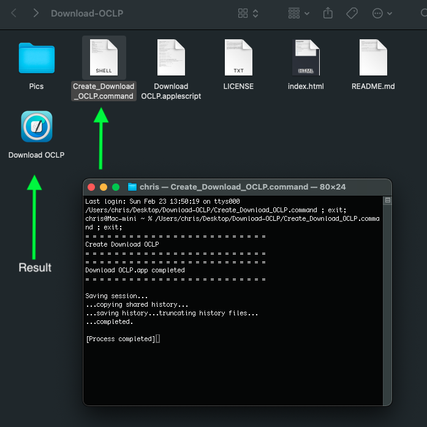
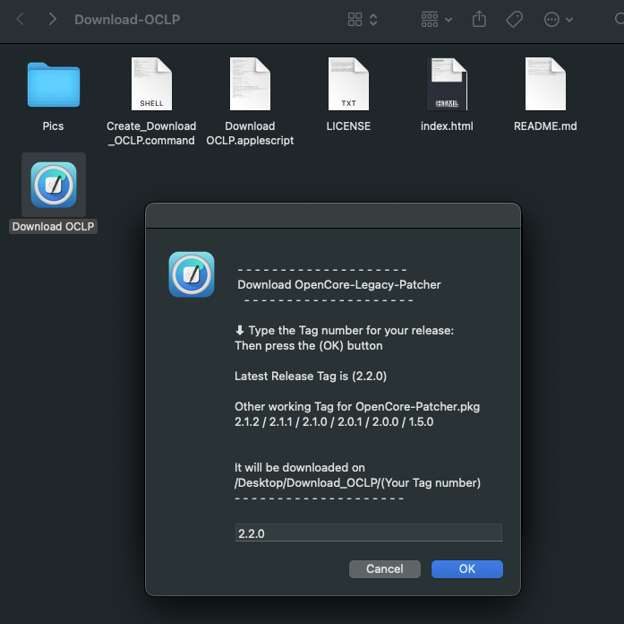
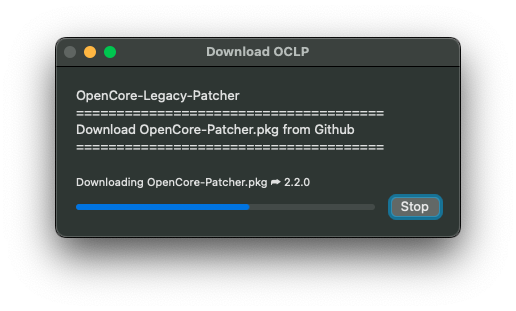
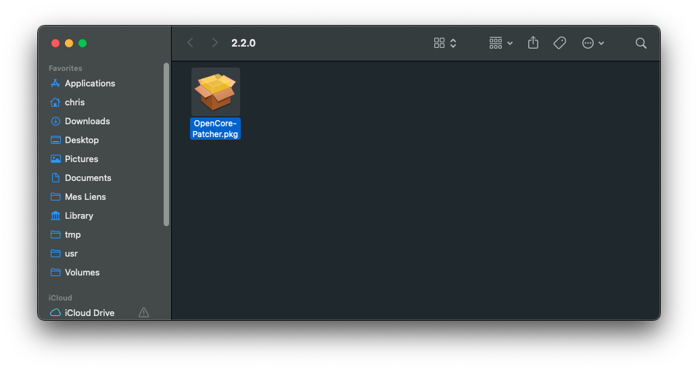

# Download OCLP

[](https://github.com/chris1111/Download-OCLP/actions/workflows/pages/pages-build-deployment)

Create an App from the Command `osacompile` to Downlod OpenCore Legacy Patcher
- Full AppleScript using Curl command to download OCLP

I share this Package for the pleasure of using the osacompile command with all the ease that it provides for the creation of an App

Credit: Big thanks to Apple

### 1- Clone this repository
```bash
git clone https://github.com/chris1111/Download-OCLP.git
```

2- Run `Create_Download_OCLP.command`

<div align="center">

<p>Open Your Download OCLP.app</p>



</div>
